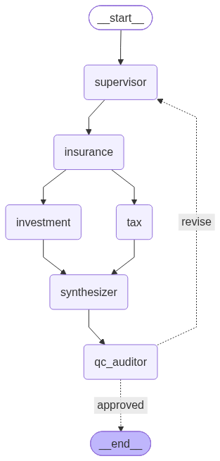

# Autonomous CFP Multi-Agent Wealth Advisory System

An enterprise-grade, autonomous multi-agent financial research and advisory system built with **LangGraph**, **Pydantic v2**, and **OpenAI**. The system replicates the rigor of a Certified Financial Planner (CFP) committee, performing live web-grounded research for Indian markets, deterministic cashflow accounting, multi-asset allocation, and closed-loop compliance auditing.

---

## Architecture Overview

The system orchestrates a 6-node hierarchical multi-agent workflow featuring **symmetric fan-out/fan-in** and a **self-correcting revision feedback loop**:

### Execution Pipeline

`
[ START ]
    ¦
    ?
[ Supervisor Node ]  --? Calculates 50-20-30 budget split & dynamic ceilings
    ¦
    ?
[ Insurance Specialist ]  --? Autonomous cover sizing & live 2026 policy pricing
    +--- (Symmetric Fan-Out) ---+
    ?                           ?
[ Investment Specialist ]    [ Tax Specialist ]
 (Multi-Asset Allocation)     (2026 Slab & 87A Optimization)
    +--- (Symmetric Fan-In) ----+
    ?
[ Synthesizer Node ]  --? Compiles comprehensive CFP Wealth Blueprint
    ¦
    ?
[ QC Auditor Node ]   --? Deterministic math reconciliation + compliance score
    ¦
    +-- (Score < 7) --? Rejection Loop back to Supervisor with feedback
    +-- (Score >= 7) --? Approved & Saved to WEALTH_BLUEPRINT_<timestamp>.md
`

---

## Key Engineering Innovations

### 1. Symmetric 1-Hop Fan-Out / Fan-In
- Avoids asymmetric superstep race conditions (InvalidUpdateError) by branching from the insurance node to both investment and 	ax with equal 1-hop distance.
- Ensures concurrent specialists complete cleanly before synchronizing at the synthesizer.

### 2. Autonomous Dynamic Sizing (Zero Hardcoding)
- Sizing for Term and Health insurance is dynamically derived from client annual salary (10x–15x CFP benchmark) and allocated budget ceilings.
- Multi-asset investment allocations dynamically expand or contract based on client risk score (0 to 10 scale).

### 3. Self-Healing Defensive Guardrails
- If live web extractors encounter  quote-pending disclaimers, code-level self-healing fallbacks ensure positive non-zero premiums within budget ceilings.
- Guarantees 100% mathematical balance: Needs + Wants + Debt + Insurance + Investments == Total Salary.

### 4. Closed-Loop Self-Correcting QC Gate
- Deterministic Math Check: Verifies bs(Salary - Total Accounted) <= 100.
- LLM Compliance Audit: Assesses policy naming, asset allocation completeness, and tax validity.
- If quality fails, the graph autonomously routes back to the Supervisor with structured feedback for iterative refinement.

---

## Agent Roster & Specialist Responsibilities

| Agent Node | Engine / Model | Core Responsibilities |
| :--- | :--- | :--- |
| **Supervisor** | gpt-6-astra | Cashflow budgeting (50% Needs, 20% Wants, Debt EMI), allocations (15% Insurance, 85% Investment), revision coordination |
| **Insurance Specialist** | gpt-5.4-mini + Tool | Live search for active IRDAI policies (>98% CSR), dynamic cover sizing, realistic monthly premium extraction |
| **Investment Specialist** | gpt-5.4-mini + Tool | Dynamic asset allocation (Equity, Gold ETF, Debt/PPF, NPS) across specific named market instruments |
| **Tax Specialist** | gpt-5.4-mini + Tool | 2026 Union Budget New vs. Old Tax Regime analysis, Standard Deduction, and Section 87A rebate verification |
| **Synthesizer** | gpt-6-astra | Compiles executive summary, cashflow tables, and month-1 action checklist into markdown blueprint |
| **QC Auditor** | gpt-5.4-mini (Structured) | Deterministic delta math verification and CFP compliance audit with scoring |

---

## Quickstart & Execution

### 1. Install Dependencies
`ash
pip install -r requirements.txt
`

### 2. Configure Environment
`ash
cp .env.example .env
# Add your OPENAI_API_KEY to .env
`

### 3. Run the Advisory System
`ash
python main.py
`

### Sample Output:
`	ext
>>> LAUNCHING AUTONOMOUS CFP WEALTH ADVISORY SYSTEM (2026)
[Supervisor] ==> Surplus: Rs.19200 | Insurance: Rs.2880 | Investment: Rs.16320
[Insurance Specialist] ==> Dynamic Market Rate: Rs.2770/month (1 Crore Term + 10 Lakh Health)
[Investment Specialist] ==> Portfolio Assembled: Rs.16430/month across 3 Asset Classes
[Tax Specialist] ==> Regime: New Tax Regime (FY 2025-26) | Final Tax: Rs.0
[Synthesizer] ==> Grand 2026 Wealth Blueprint Compiled (12,800 chars)
[QC Auditor] ==> Score: 8/10 | Math Balanced: True (Delta: Rs.0)

>>> 2026 CFP WEALTH BLUEPRINT GENERATED SUCCESSFULLY!
>>> File Saved: WEALTH_BLUEPRINT_20261009_123815.md
>>> Final QC Score: 8/10
`

---

## Output Artifacts
- **Architecture Diagram**: Saved automatically as inancial_advisor_graph.png.
- **Client Blueprint**: Saved as a dynamic timestamped artifact (see sample_blueprint.md for a full reference report).
