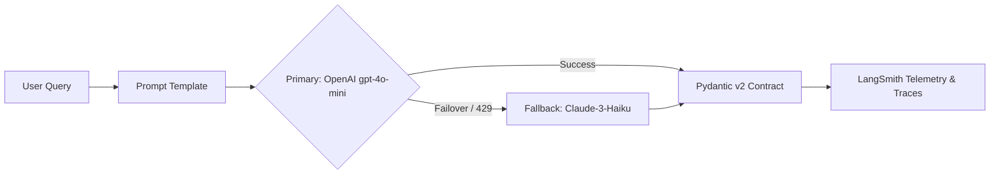
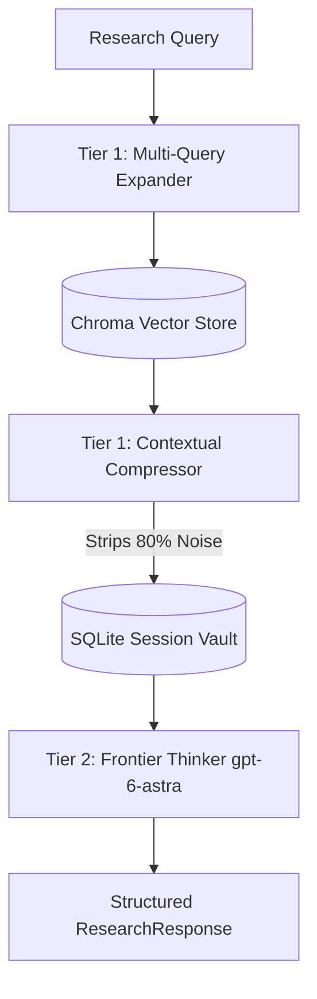
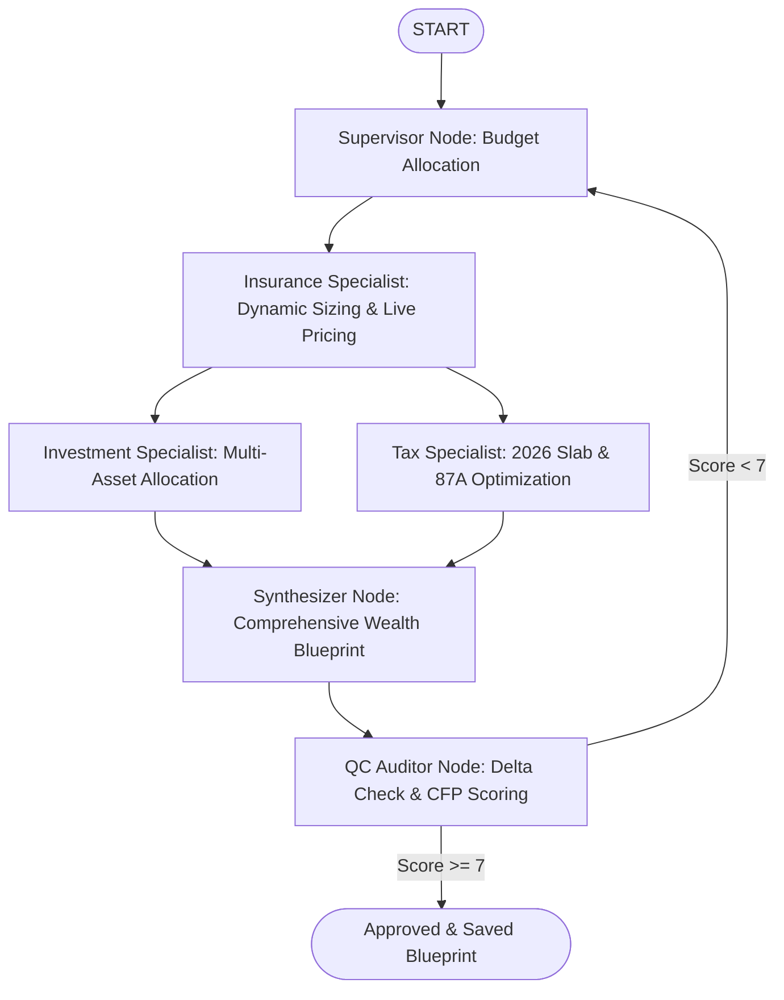

# Production GenAI Systems: Architecture & Implementation Suite

An enterprise-grade repository showcasing robust, production-tested Generative AI architectures, multi-provider resiliency patterns, advanced two-tier RAG systems, and autonomous multi-agent stateful graph workflows.

Developed and maintained by **[Jagadesh Vuppala](https://github.com/Jagadesh-Vuppala)**.

---

## Systems Portfolio Overview

| System | Architecture Pattern | Key Tech Stack | Core Highlights |
| :--- | :--- | :--- | :--- |
| **[01-Smart-QA-Bot](./01-smart-qa-bot)** | Multi-Provider Resilient Engine | LangChain LCEL, Pydantic v2, GPT-4o-mini, Claude-3-Haiku | Zero-downtime cross-cloud failover, typed schema contracts, full telemetry |
| **[02-AI-Research-Assistant](./02-ai-research-assistant)** | Two-Tier Advanced RAG | LangChain, ChromaDB, SQLite, Pydantic v2, GPT-6-Astra | High-recall Multi-Query, noise-filtering contextual compression, persistent SQLite session memory |
| **[03-Autonomous-Financial-Advisor](./03-autonomous-financial-advisor)** | Autonomous Multi-Agent CFP System | LangGraph, Pydantic v2, DuckDuckGo Search, GPT-6-Astra | Symmetric 1-hop fan-out/fan-in, self-healing dynamic guardrails, deterministic cashflow accounting, closed-loop QC audit |

---

## Architectural Deep-Dives

### 01. Smart Q&A Bot — Multi-Provider Resilient Engine
> **Core Problem Solved**: Eliminates single-provider downtime, HTTP 429 rate-limit drops, and untracked production token costs.



- **Cross-Cloud Zero Downtime**: Automated failover from OpenAI to Anthropic via `.with_fallbacks()`.
- **Strict Typed Contracts**: Guarantees typed Pydantic v2 output objects (`confidence`, `sources_needed`, `reasoning`).
- **Enterprise Observability**: Integrated LangSmith tracing for latency trees, token usage, and cost monitoring.
- **Dedicated Documentation & Code**: [`01-smart-qa-bot`](./01-smart-qa-bot)

---

### 02. AI Research Assistant — Two-Tier Advanced RAG
> **Core Problem Solved**: Overcomes vector search vocabulary mismatch, chunk noise pollution, and session amnesia.



- **High-Recall Multi-Query Expansion**: Generates 3 academic query reformulations to bridge lexical vocabulary gaps.
- **Contextual Token Compression**: Strips 80% irrelevant fluff, feeding only verified facts and formulas to Tier 2.
- **Persistent SQLite Vault**: Multi-turn conversation retention across restarts via `SQLChatMessageHistory`.
- **Dedicated Documentation & Code**: [`02-ai-research-assistant`](./02-ai-research-assistant)

---

### 03. Autonomous Financial Advisor — CFP Multi-Agent System
> **Core Problem Solved**: Replaces hallucinated financial advice with live web-grounded market discovery, strict mathematical reconciliation, and closed-loop compliance auditing.



- **Symmetric 1-Hop Fan-Out / Fan-In**: Eliminates asynchronous superstep race conditions (`InvalidUpdateError`) by enforcing uniform hop distances between concurrent specialists.
- **Autonomous Dynamic Sizing**: Derives Term & Health cover dynamically from salary (10x–15x rule) and budget constraints via live web search.
- **Deterministic Cashflow Balancing**: Enforces zero-leakage accounting (`Needs + Wants + Debt + Insurance + Investments == Total Salary`).
- **Closed-Loop Audit Gate**: Deterministic delta math verification + CFP compliance scoring with automated revision routing.
- **Dedicated Documentation & Code**: [`03-autonomous-financial-advisor`](./03-autonomous-financial-advisor)

---

## Quickstart & Execution

Each system is completely self-contained with dedicated code, dependencies, and documentation:

```bash
# Clone the repository
git clone https://github.com/Jagadesh-Vuppala/production-genai-systems.git
cd production-genai-systems

# System 01: Smart Q&A Bot
cd 01-smart-qa-bot && pip install -r requirements.txt && python smart_bot_section_1.py

# System 02: AI Research Assistant
cd ../02-ai-research-assistant && pip install -r requirements.txt && python app.py

# System 03: Autonomous Financial Advisor
cd ../03-autonomous-financial-advisor && pip install -r requirements.txt && python main.py
```

---

## Author & Maintainer
**Jagadesh Vuppala**  
*Senior Generative AI & LLM Systems Engineer*  
*GitHub:* [@Jagadesh-Vuppala](https://github.com/Jagadesh-Vuppala)
